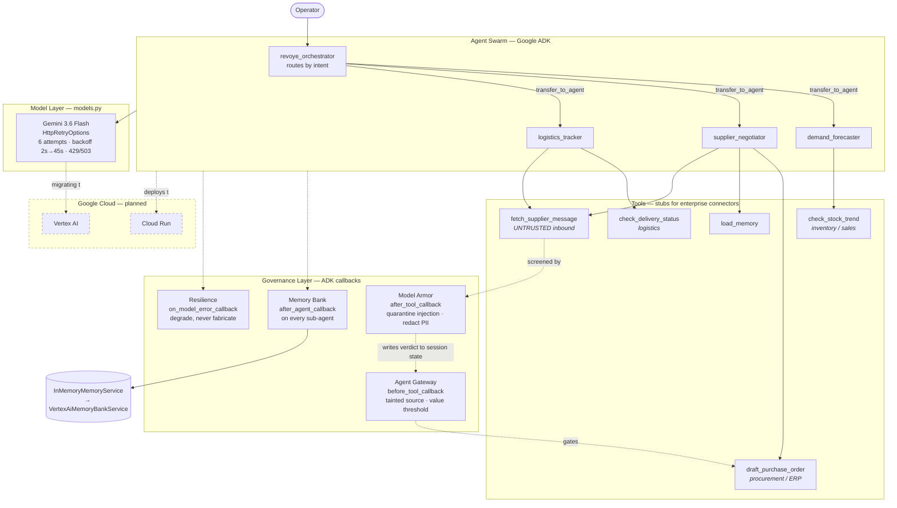

# Revoyé — Architecture

## Request path

1. Operator states a goal. The orchestrator picks a specialist and delegates.
2. The specialist calls its tools. Anything arriving from outside the system
   (`fetch_supplier_message`) is screened by Model Armor at the tool boundary
   before the model ever sees it.
3. Armor records a per-supplier verdict in session state.
4. The Agent Gateway reads that verdict before `draft_purchase_order` runs.
   A quarantined source or an over-threshold value means the tool never
   executes — enforcement does not depend on the model cooperating.
5. Whichever agent finishes the turn writes the session to the Memory Bank,
   so negotiation history survives into later sessions.
6. If the model provider fails, retry backs off; if retries exhaust, the turn
   degrades to an explicit "no action taken" rather than a fabricated result.

## Notes

- Tools return fixed values. They are stubs standing in for inventory,
  procurement, and logistics connectors, not live integrations.
- Dashed nodes are planned, not yet built.
